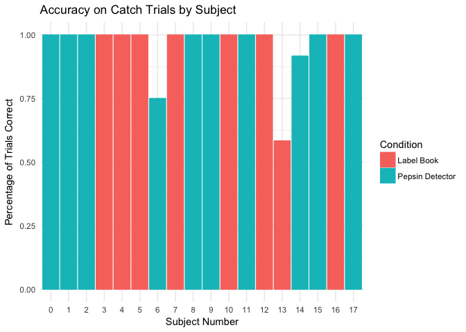

Critter Game - Sandbox Data
================
Lauren Oey
7/6/2017

``` r
library(dplyr)
```

    ## 
    ## Attaching package: 'dplyr'

    ## The following objects are masked from 'package:stats':
    ## 
    ##     filter, lag

    ## The following objects are masked from 'package:base':
    ## 
    ##     intersect, setdiff, setequal, union

``` r
library(tidyr)
library(ggplot2)
library(data.table)
```

    ## 
    ## Attaching package: 'data.table'

    ## The following objects are masked from 'package:dplyr':
    ## 
    ##     between, first, last

``` r
# library(xtable)


# setting the directory
setwd("../mturk/game-1/")


sandbox_data <- read.csv("game-1-catch_trials.csv")

# View(sandbox_data)

str(sandbox_data)
```

    ## 'data.frame':    24 obs. of  26 variables:
    ##  $ workerid       : int  0 0 0 0 0 0 0 0 0 0 ...
    ##  $ col4_crit      : int  -99 -99 -99 -99 -99 -99 -99 -99 -99 -99 ...
    ##  $ prop1_crit     : Factor w/ 1 level "height": 1 1 1 1 1 1 1 1 1 1 ...
    ##  $ prop2_crit     : Factor w/ 1 level "fatness": 1 1 1 1 1 1 1 1 1 1 ...
    ##  $ trial_num      : int  1 2 3 4 5 6 7 8 9 10 ...
    ##  $ question       : Factor w/ 2 levels "tar1","tar2": 1 1 2 1 2 1 1 1 2 2 ...
    ##  $ time_in_seconds: num  5.25 14.8 95.38 6.28 13.63 ...
    ##  $ critter        : Factor w/ 1 level "bird": 1 1 1 1 1 1 1 1 1 1 ...
    ##  $ col1_crit      : Factor w/ 1 level "crest": 1 1 1 1 1 1 1 1 1 1 ...
    ##  $ tar1_crit      : Factor w/ 1 level "tail": 1 1 1 1 1 1 1 1 1 1 ...
    ##  $ tar2_crit      : Factor w/ 1 level "crest": 1 1 1 1 1 1 1 1 1 1 ...
    ##  $ col3_crit      : Factor w/ 1 level "wing": 1 1 1 1 1 1 1 1 1 1 ...
    ##  $ prop2          : num  0.8843 0.0815 0.2841 0.0306 0.5999 ...
    ##  $ col4           : int  -99 -99 -99 -99 -99 -99 -99 -99 -99 -99 ...
    ##  $ col5           : int  -99 -99 -99 -99 -99 -99 -99 -99 -99 -99 ...
    ##  $ col2           : Factor w/ 17 levels "#00fc1a","#00fd1a",..: 16 4 15 9 14 3 12 16 10 6 ...
    ##  $ col3           : Factor w/ 17 levels "-99","#012e09",..: 12 3 1 1 14 4 1 11 17 5 ...
    ##  $ col1           : Factor w/ 24 levels "#0a871f","#158b1d",..: 23 3 20 17 18 8 14 13 10 7 ...
    ##  $ response       : Factor w/ 2 levels "No","Yes": 1 2 1 2 1 1 2 1 1 1 ...
    ##  $ condition      : Factor w/ 1 level "pepsin_detector": 1 1 1 1 1 1 1 1 1 1 ...
    ##  $ trial_type     : Factor w/ 1 level "learning_trial": 1 1 1 1 1 1 1 1 1 1 ...
    ##  $ prop1          : num  0.8546 0.7222 0.8136 0.0448 0.7412 ...
    ##  $ col2_crit      : Factor w/ 1 level "body": 1 1 1 1 1 1 1 1 1 1 ...
    ##  $ col5_crit      : int  -99 -99 -99 -99 -99 -99 -99 -99 -99 -99 ...
    ##  $ tar2           : int  0 0 0 0 0 0 0 0 0 0 ...
    ##  $ tar1           : int  0 1 1 1 0 0 1 0 1 0 ...

``` r
summary(sandbox_data)
```

    ##     workerid     col4_crit    prop1_crit   prop2_crit   trial_num    
    ##  Min.   :0.0   Min.   :-99   height:24   fatness:24   Min.   : 1.00  
    ##  1st Qu.:0.0   1st Qu.:-99                            1st Qu.: 3.75  
    ##  Median :0.5   Median :-99                            Median : 6.50  
    ##  Mean   :0.5   Mean   :-99                            Mean   : 6.50  
    ##  3rd Qu.:1.0   3rd Qu.:-99                            3rd Qu.: 9.25  
    ##  Max.   :1.0   Max.   :-99                            Max.   :12.00  
    ##                                                                      
    ##  question  time_in_seconds  critter   col1_crit  tar1_crit tar2_crit 
    ##  tar1:14   Min.   : 3.965   bird:24   crest:24   tail:24   crest:24  
    ##  tar2:10   1st Qu.: 7.869                                            
    ##            Median :11.257                                            
    ##            Mean   :18.553                                            
    ##            3rd Qu.:15.749                                            
    ##            Max.   :95.383                                            
    ##                                                                      
    ##  col3_crit     prop2              col4          col5          col2   
    ##  wing:24   Min.   :0.03061   Min.   :-99   Min.   :-99   #fdfd00: 4  
    ##            1st Qu.:0.31104   1st Qu.:-99   1st Qu.:-99   #fd4500: 3  
    ##            Median :0.60836   Median :-99   Median :-99   #00fc1a: 2  
    ##            Mean   :0.55939   Mean   :-99   Mean   :-99   #fefe00: 2  
    ##            3rd Qu.:0.83538   3rd Qu.:-99   3rd Qu.:-99   #00fd1a: 1  
    ##            Max.   :0.96356   Max.   :-99   Max.   :-99   #00fe1a: 1  
    ##                                                          (Other):11  
    ##       col3         col1    response           condition 
    ##  -99    : 8   #0a871f: 1   No :16   pepsin_detector:24  
    ##  #012e09: 1   #158b1d: 1   Yes: 8                       
    ##  #028b19: 1   #1b833a: 1                                
    ##  #056506: 1   #239923: 1                                
    ##  #0c3e13: 1   #2e9f44: 1                                
    ##  #0f8221: 1   #56f075: 1                                
    ##  (Other):11   (Other):18                                
    ##           trial_type     prop1          col2_crit   col5_crit  
    ##  learning_trial:24   Min.   :0.006428   body:24   Min.   :-99  
    ##                      1st Qu.:0.223957             1st Qu.:-99  
    ##                      Median :0.506531             Median :-99  
    ##                      Mean   :0.484701             Mean   :-99  
    ##                      3rd Qu.:0.746533             3rd Qu.:-99  
    ##                      Max.   :0.993452             Max.   :-99  
    ##                                                                
    ##       tar2        tar1    
    ##  Min.   :0   Min.   :0.0  
    ##  1st Qu.:0   1st Qu.:0.0  
    ##  Median :0   Median :0.5  
    ##  Mean   :0   Mean   :0.5  
    ##  3rd Qu.:0   3rd Qu.:1.0  
    ##  Max.   :0   Max.   :1.0  
    ## 

Adjusting Dataframe
===================

``` r
#attach(sandbox_data)
sandbox_data$question_name <- as.factor(ifelse(sandbox_data$question=="tar1", "tail", "head"))
sandbox_data$tar1_logic <- as.logical(sandbox_data$tar1)
sandbox_data$tar2_logic <- as.logical(sandbox_data$tar2)
sandbox_data$trial_num <- as.factor(sandbox_data$trial_num)
sandbox_data$workerid <- as.factor(sandbox_data$workerid)
sandbox_data$response_logic <- ifelse(sandbox_data$response=="Yes", TRUE, FALSE)
sandbox_data$Correct <- ifelse(sandbox_data$question_name=="tail", ifelse(sandbox_data$tar1_logic==sandbox_data$response_logic, TRUE, FALSE), ifelse(sandbox_data$tar2_logic==sandbox_data$response_logic, TRUE, FALSE))
```

Proportion Correct By Subject
=============================

``` r
sandbox_data_by_subj <- sandbox_data %>%
  group_by(workerid, trial_num, condition) %>%
  distinct() %>%
  summarise(Total = 1, Correct_trial = ifelse(Correct==TRUE, 1, 0)) %>%
  group_by(workerid, condition) %>%
  summarise(Total_trials = sum(Total), Correct_trials = sum(Correct_trial)) %>%
  mutate(Percentage_correct = Correct_trials/Total_trials) %>%
  select(workerid, Percentage_correct, condition)

#sandbox_data_by_subj

#xt <- xtable(sandbox_data_by_subj, type="html", caption = "Percentage of correct catch trials per subject.", label = "sandbox_data_by_subj")
#names(xt) <- c('Subject', 'Percentage of Correct Trials')
#print(xt, comment=FALSE)

graph_by_subj <- ggplot(sandbox_data_by_subj, aes(x=workerid, y=Percentage_correct, colour=condition, fill=condition)) +
  geom_bar(stat="identity") +
  scale_x_discrete("Subject Number") +
  scale_y_continuous("Percentage of Trials Correct") +
  ggtitle("Accuracy on Catch Trials by Subject") +
  theme_minimal()
graph_by_subj
```


